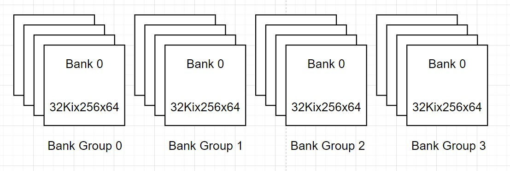

### CPU memory address to topological address mapping

* DDR4 DIMM outputs 8 bytes per cycle = 23 => 3 Byte-select bits
* Burst length is 8n => 3 Lower Column bits
* Page Size = 2KiB = 211 Bytes
  FIFO and Data MUX holds 8 Bytes (1 Byte per burst) = 23 Bytes
  Thus, 211/23 = 28 => 8 Higher Column bits
* Chosen design is 4 Bank-Groups with 4 Banks each => 2 Bank Select Bits, 2 Bank Group Select Bits
* An 8GiB DIMM has 233 addresses => 33-bits for addressing a single byte
  Thus Row bits = 33 - 3 - 3 - 8 - 2 - 2 = 15 bits

### Bank topology of SDRAM chip

* 8GiB DIMM with x8 SDRAM chips => 8 chips per DIMM
* 8GiB/8 bits per address = 1Gi addresses => SDRAM chip is 1Gix8
* With 4 bank groups with 4 banks each, we get 233bits/24 = 229 => 512Mib bank
* With page size of 2KiB = 16Kib, we get 229/214 = 215 rows => 32Ki rows
* Page size of 16Kib must be met by last 2 dimensions so we choose 256 and 64
* Thus we get 32Kix256x64 chips

